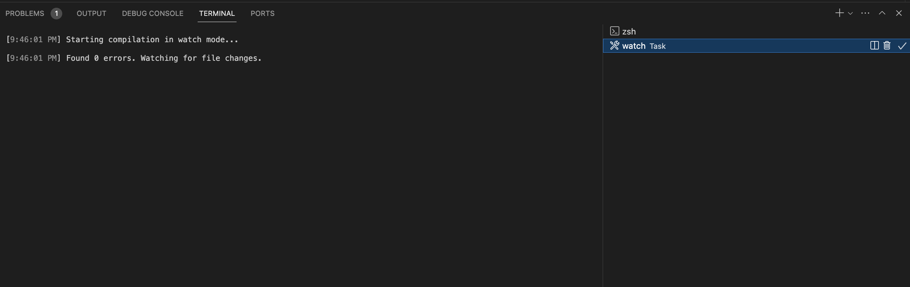
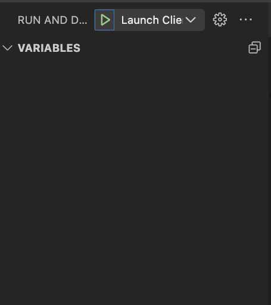
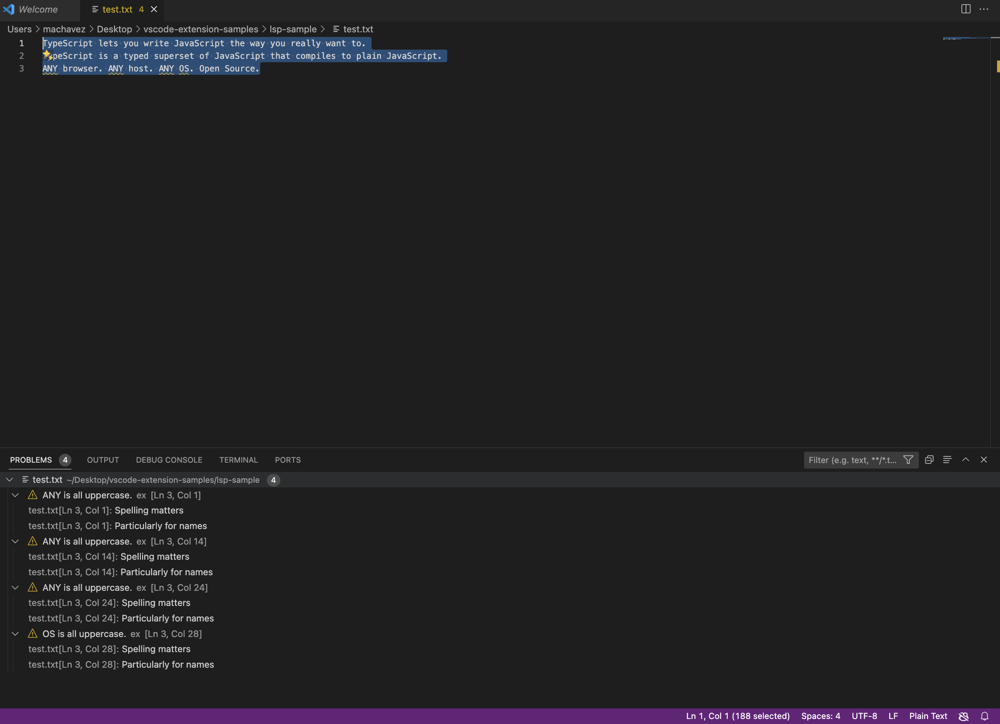

# Language Server Implementation

## Mozilla Assay Tool

This repository contains the implementation of the Mozilla Assay Tool as a Language Server. This project is part of the CSUMB Spring 2024 Capstone.

## Getting Started with Local Development

1. **Git Clone:** `git clone https://github.com/camsterrrr/MozillaAssay.git`
2. **Change Directory:** `cd MozillaAssay/`
3. **Install Dependencies:** `npm install`

This should install all necessary dependencies and packages. To begin custom development, visit `server/out/server.js`.

```javascript
documents.onDidChangeContent(change => {
    validateTextDocument(change.document);
});
```

This is an event listener that checks for when a file has been changed by the user.

The function:

```javascript
async function validateTextDocument(textDocument)
```

is a custom function that checks the files for consecutive capitalization and reports the errors in the server's terminal.

```
server
├── out
│   ├── server.js
│   └── server.js.map
```

## Running the Server

1. **Mac:** Press Shift+Command+B, this starts the build task.
   
2. Click on the Debug tab on the left side of VSCODE.
3. Make sure 'Launch Client' is selected and click play. This will open another vscode window.
   
4. Create a .txt file and paste the following:
   ```
   TypeScript lets you write JavaScript the way you really want to.
   TypeScript is a typed superset of JavaScript that compiles to plain JavaScript.
   ANY browser. ANY host. ANY OS. Open Source.
   ```
5. If it is running correctly, you should see this output in the new window:
   